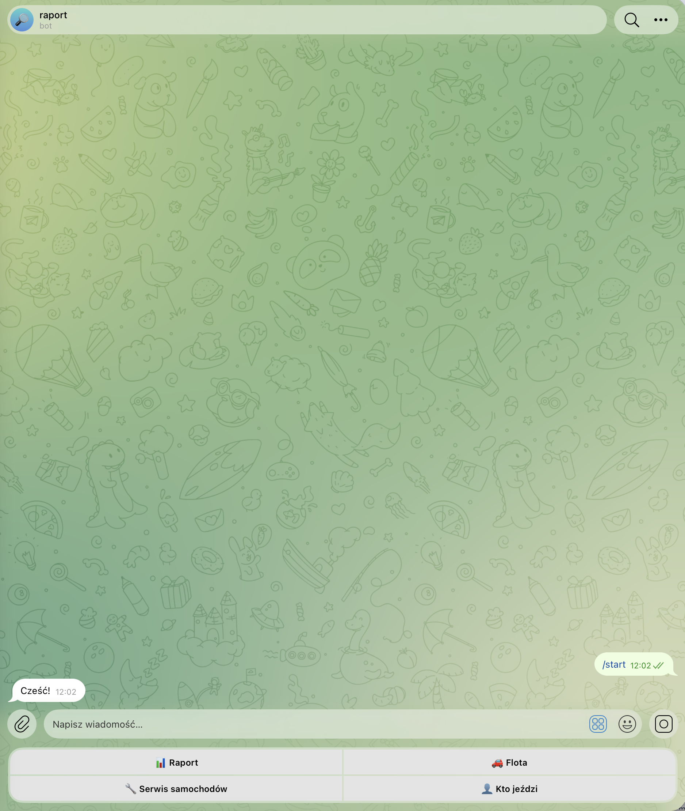
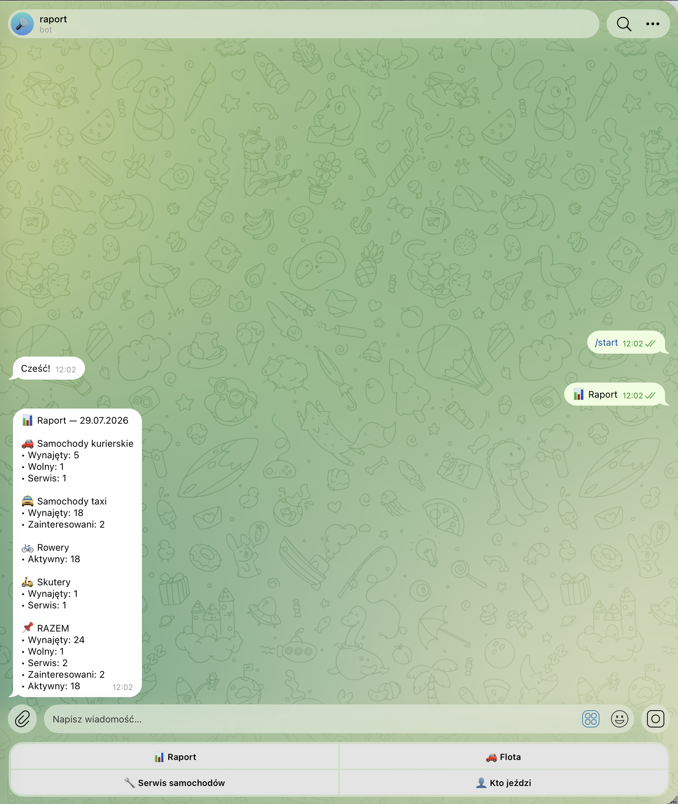
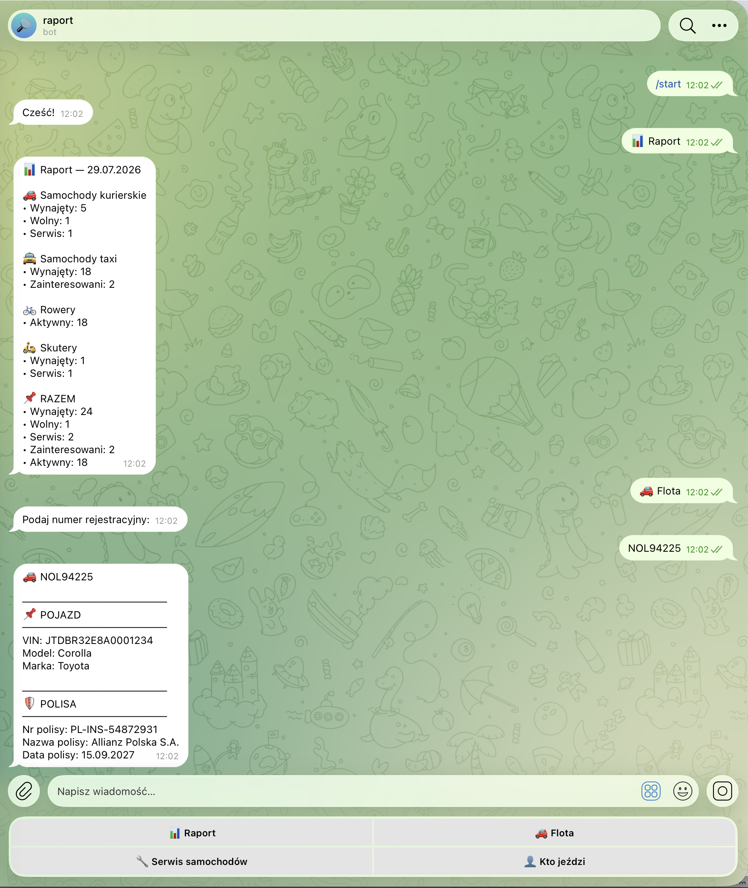
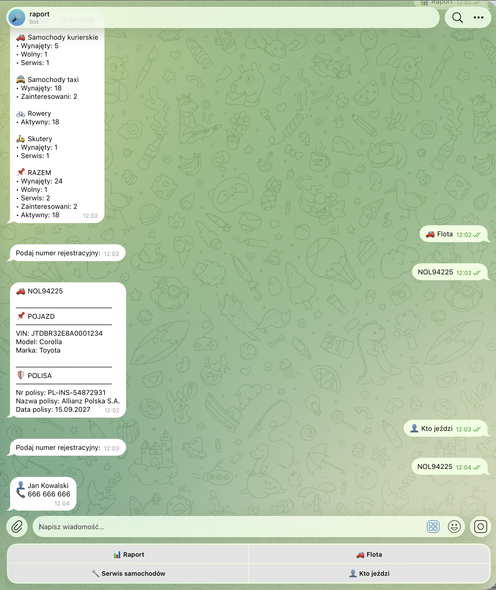

# Telegram Fleet Report Bot


A production-oriented Telegram bot for fleet management and operational reporting.

The application integrates with Google Sheets, generates real-time fleet reports, provides instant driver and vehicle lookup, and controls user access through a centralized permission system.

> **Portfolio version:** All credentials, company data, and sensitive business information have been removed.

---

# Overview

This project was developed to automate day-to-day fleet operations through Telegram.

Managers can instantly:

- Generate operational fleet reports
- Identify the active driver assigned to a vehicle
- Retrieve vehicle and insurance information
- Verify user permissions
- Receive scheduled reports

The solution eliminates manual spreadsheet navigation and provides a fast interface for operational staff.

---

# Features

- Fleet status reporting
- Driver lookup by registration number
- Vehicle information lookup
- Google Sheets integration
- Telegram Reply & Inline Keyboards
- User access control
- Scheduled reports
- Modular architecture
- Environment-based configuration

---

# Architecture

```text
                    Google Sheets
                          │
                          ▼
                 Data Processing Layer
                          │
        ┌─────────────────┼─────────────────┐
        ▼                 ▼                 ▼
 Driver Lookup      Fleet Lookup      Report Builder
        │                 │                 │
        └─────────────────┼─────────────────┘
                          ▼
                 Telegram Bot (Aiogram)
                          │
                          ▼
                        Users
```

---

# Technology Stack

- Python 3.11+
- Aiogram 3.x
- Google Sheets API
- APScheduler
- python-dotenv

---

# Project Structure

```text
telegram-fleet-report-bot
│
├── bot.py
├── access.py
├── config.py
├── fleet.py
├── google_sheets.py
├── reports.py
├── requirements.txt
├── example-data.csv
├── README.md
├── LICENSE
├── start.png
├── report.png
├── flota.png
└── driver.png
```

---

# Core Functionality

## Fleet Reporting

Builds a consolidated operational report by collecting information from multiple Google Sheets and grouping vehicles by their current status.

## Driver Lookup

Searches the active driver assigned to a registration plate.

## Fleet Information

Displays structured information about:

- Vehicle
- Insurance
- Company details

## Access Control

Only users marked as active inside the authorization sheet are allowed to use the bot.

## Scheduled Reports

Supports automatic report delivery using APScheduler.

---

# Screenshots

## Welcome



## Report



## Fleet Lookup



## Driver Lookup



---# Installation

```bash
git clone https://github.com/YOUR_USERNAME/telegram-fleet-report-bot.git

cd telegram-fleet-report-bot

python -m venv .venv

# Windows
.venv\Scripts\activate

# Linux / macOS
source .venv/bin/activate

pip install -r requirements.txt
```

---

# Configuration

Create a `.env` file.

```env
BOT_TOKEN=your_bot_token
GOOGLE_SHEET_KEY=your_google_sheet_key
GOOGLE_CREDENTIALS_FILE=service_account.json
```

Share your Google Spreadsheet with the Google Service Account before running the application.

---

# Run

```bash
python bot.py
```

---

# Security

The public version intentionally excludes:

- Telegram Bot Token
- Google Service Account credentials
- Production Google Sheets
- Internal company information
- Personal data
- Customer records

---

# Future Improvements

- PostgreSQL support
- Docker deployment
- REST API
- Admin Dashboard
- Unit Tests
- GitHub Actions CI/CD

---

# Skills Demonstrated

This repository demonstrates practical experience with:

- Python backend development
- Telegram bot development
- Google Workspace integration
- Business process automation
- Report generation
- Access management
- Modular application architecture
- Environment-based configuration
- Google Sheets automation
- Clean project organization

---

# License

This project is licensed under the MIT License.
